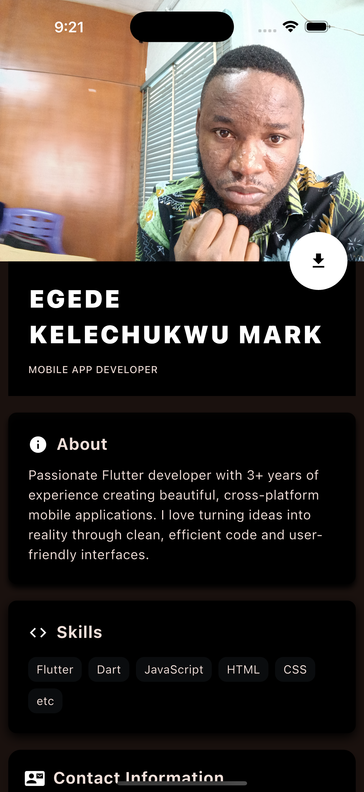

My Profile App
A personal profile mobile app built with Flutter that displays professional information in a clean, modern design.
What is this app?
This is a mobile application that showcases a developer's profile information, similar to a digital business card or portfolio. The app displays:

Personal Information: Name and job title
About Section: Brief professional description
Skills: Technical skills displayed as tags
Contact Information: Email, phone, and social media links
Profile Download: Button to download/share the profile

📱 Screenshots

The app features a dark theme with:

Profile image background
Clean typography
Organized sections
Interactive download button

🚀 How to Run

Install Flutter on your computer
Clone this project
bashgit clone https://github.com/yourusername/flutter-profile-app.git
cd flutter-profile-app

Get dependencies
bashflutter pub get

Run the app
bashflutter run